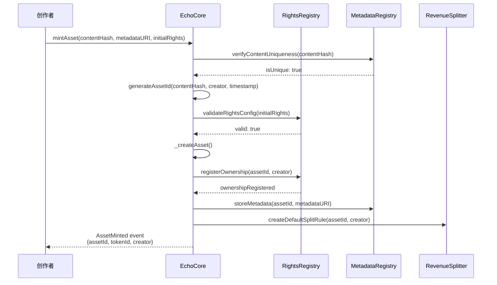
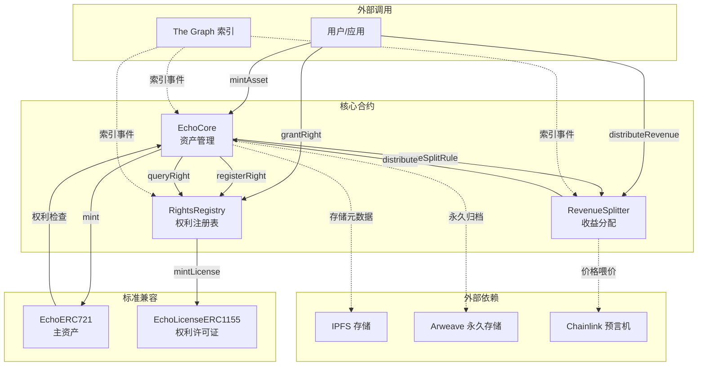
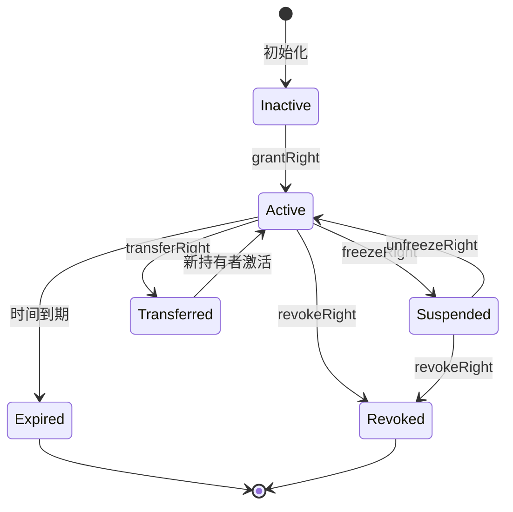
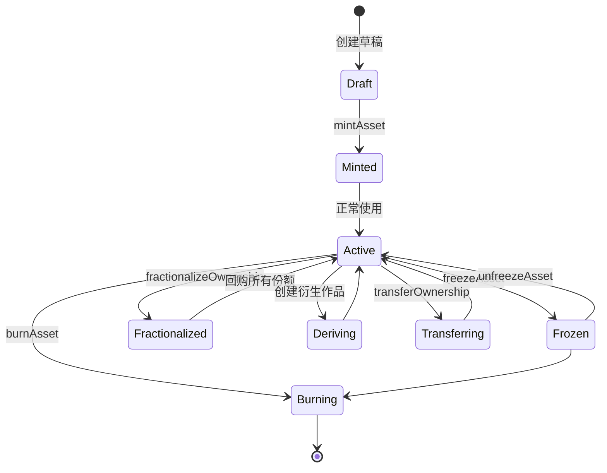

# ECHO 协议核心架构设计

> **版本**: v0.1.0-alpha  
> **作者**: ECHO Protocol Architect Agent  
> **日期**: 2026-04-03  
> **状态**: 设计草案

---

## 目录

1. [协议核心概念](#1-协议核心概念)
2. [智能合约架构](#2-智能合约架构)
3. [资产生命周期](#3-资产生命周期)
4. [技术规范](#4-技术规范)
5. [架构图](#5-架构图)
6. [关键决策点](#6-关键决策点)

---

## 1. 协议核心概念

### 1.1 四维权利模型

ECHO 协议定义了数字资产的**四维权利空间**，每一维权利都是独立且可组合的原子单元。

#### 1.1.1 所有权 (Ownership)

| 维度 | 说明 |
|------|------|
| **功能名称** | 所有权 (OWN) |
| **功能描述** | 资产的终极控制权，决定资产的存在、销毁和核心属性的变更。所有权是其他所有权利的根源。 |
| **输入** | 资产标识符 (assetId), 当前所有者地址, 新所有者地址 (转移时) |
| **输出** | 所有权状态 (owner, timestamp, blockNumber) |
| **边界情况** | • 所有权转移需原所有者签名<br>• 所有权可拆分（分数化所有权）<br>• 所有权销毁即资产永久消失 |

**核心权限**:
- 销毁资产 (burn)
- 修改核心元数据
- 授予/回收其他权利
- 设置继承规则

#### 1.1.2 使用权 (Usage Rights)

| 维度 | 说明 |
|------|------|
| **功能名称** | 使用权 (USE) |
| **功能描述** | 访问、展示、运行资产内容的权利。使用权可以有时间限制、场景限制、次数限制。 |
| **输入** | 资产标识符 (assetId), 被授权者地址, 使用范围 (scope), 有效期 (duration) |
| **输出** | 使用许可凭证 (licenseId, validUntil, usageCount) |
| **边界情况** | • 使用许可可转售（次级授权）<br>• 超出范围使用触发违规记录<br>• 使用权过期自动失效 |

**使用权参数矩阵**:
```json
{
  "scope": {
    "platform": ["web", "vr", "ar", "mobile"],
    "territory": ["CN", "US", "EU", "GLOBAL"],
    "purpose": ["personal", "commercial", "educational", "research"]
  },
  "constraints": {
    "maxViews": 10000,
    "maxDuration": 3600,
    "concurrentUsers": 5
  }
}
```

#### 1.1.3 衍生权 (Derivation Rights)

| 维度 | 说明 |
|------|------|
| **功能名称** | 衍生权 (DER) |
| **功能描述** | 基于原资产创作新作品的权利，包含改编、混音、二次创作等。衍生权涉及复杂的权利继承和收益分配。 |
| **输入** | 父资产标识符 (parentAssetId), 创作者地址, 衍生类型 (type), 收益分配比例 (splitRatio) |
| **输出** | 衍生许可凭证 (derivationId), 派生资产预授权 (preMintRight) |
| **边界情况** | • 衍生作品必须引用父资产<br>• 多层衍生形成权利链<br>• 收益按比例自动分发给权利链上所有相关方 |

**衍生类型**:
- `ADAPTATION`: 改编（如小说改电影）
- `REMIX`: 混音/混剪
- `QUOTE`: 引用/采样
- `FORK`: 分叉（代码/设计）
- `MERGE`: 多资产融合

#### 1.1.4 扩展权 (Extension Rights)

| 维度 | 说明 |
|------|------|
| **功能名称** | 扩展权 (EXT) |
| **功能描述** | 为资产添加新功能、插件、模块的权利。扩展权允许资产在保持核心不变的情况下进化。 |
| **输入** | 资产标识符 (assetId), 扩展者地址, 扩展类型 (extensionType), 扩展内容哈希 (contentHash) |
| **输出** | 扩展模块标识符 (extensionId), 版本号 (version), 兼容性标记 |
| **边界情况** | • 扩展模块独立版本控制<br>• 扩展可依赖其他扩展（依赖图）<br>• 扩展被采用后创作者获得收益分成 |

### 1.2 权利依赖与互斥规则

#### 1.2.1 依赖关系图

```
┌─────────────┐
│  所有权(OWN) │ ← 根权利，唯一且排他
└──────┬──────┘
       │ 依赖：必须持有所有权才能授予其他权利
       ▼
┌─────────────┐     ┌─────────────┐
│ 使用权(USE)  │◄───►│ 衍生权(DER) │ ← 可并行持有
└──────┬──────┘     └──────┬──────┘
       │                   │
       └─────────┬─────────┘
                 ▼
          ┌─────────────┐
          │ 扩展权(EXT)  │ ← 依赖 USE 或 DER 至少其一
          └─────────────┘
```

#### 1.2.2 权利矩阵规则

| 权利组合 | 状态 | 说明 |
|----------|------|------|
| OWN + USE | ✅ 允许 | 所有者自使用 |
| OWN + DER | ✅ 允许 | 所有者自衍生 |
| OWN + EXT | ✅ 允许 | 所有者自扩展 |
| USE + DER | ✅ 允许 | 被授权者创作衍生作品 |
| USE + EXT | ✅ 允许 | 被授权者开发扩展 |
| DER + EXT | ✅ 允许 | 衍生作品作者添加扩展 |
| OWN + USE + DER | ✅ 允许 | 完全控制 |
| OWN (单独) | ✅ 允许 | 仅持有不操作 |
| USE (单独) | ✅ 允许 | 纯消费者 |
| DER (单独) | ❌ 禁止 | 必须至少持有 USE 或 OWN |
| EXT (单独) | ❌ 禁止 | 必须至少持有 USE 或 DER |

#### 1.2.3 权利冲突解决

**冲突场景 1**: 所有权转移时存在未过期的使用权
- **规则**: 使用权继续有效直至过期，但新所有者有权不再续期
- **实现**: 使用权合约记录原所有者授权，新所有者通过 `transferOwnership` 时触发 `RightsFrozen` 事件

**冲突场景 2**: 衍生作品创建后父资产所有权变更
- **规则**: 已授权的衍生权不受影响，新衍生需新所有者授权
- **实现**: 衍生权记录授权时的所有者地址，变更时检查时间戳

**冲突场景 3**: 使用权和衍生权期限重叠时的收益分配
- **规则**: 按时间权重分配，同时触发时按比例分成
- **实现**: RevenueSplitter 合约按区块时间计算权重

### 1.3 引用关系与版本谱系

#### 1.3.1 引用图谱模型

```
Asset A (v1.0)
    │
    ├── DERIVES ──► Asset B (v1.0) ── QUOTES ──► Asset C (v1.0)
    │                   │
    │                   ├── FORKS ──► Asset B' (v1.0) [兄弟版本]
    │                   │
    │                   └── DERIVES ──► Asset D (v1.0)
    │                           │
    │                           └── EXTENDS ──► Asset D-ext (v1.1)
    │
    └── USES ──► Asset E (v1.0)
            │
            └── DERIVES ──► Asset F (v1.0)
```

#### 1.3.2 引用类型定义

| 引用类型 | 关系强度 | 权利继承 | 典型场景 |
|----------|----------|----------|----------|
| `PARENT_CHILD` | 强 | 完全继承 | 原创作品与其衍生 |
| `SIBLING` | 中 | 部分继承 | 同父资产的不同改编 |
| `QUOTE` | 弱 | 无继承 | 采样/引用片段 |
| `FORK` | 强 | 继承至分叉点 | 代码/创意分叉 |
| `MERGE` | 中 | 按比例继承 | 多资产融合 |
| `EXTENDS` | 弱 | 无继承 | 功能扩展 |

#### 1.3.3 版本谱系追踪

**谱系结构**:
```typescript
interface Lineage {
  assetId: bytes32;           // 当前资产ID
  generation: uint256;        // 代数（原创=0）
  
  // 上游引用
  parents: ParentRef[];       // 父资产列表
  
  // 下游引用
  children: bytes32[];        // 子资产列表
  siblings: bytes32[];        // 兄弟资产列表
  
  // 版本信息
  version: SemanticVersion;   // 语义化版本
  branch: string;             // 分支名（main/feature）
  
  // 权利链
  rightsChain: RightsRef[];   // 权利引用链
}

interface ParentRef {
  assetId: bytes32;
  relationType: RelationType; // DERIVES/QUOTES/FORKS/USES
  weight: uint256;            // 贡献权重（用于收益分配）
  blockNumber: uint256;       // 引用区块
}
```

**谱系查询函数**:

| 功能名称 | 功能描述 | 输入 | 输出 | 边界情况 |
|----------|----------|------|------|----------|
| `getAncestors` | 获取资产的所有祖先节点 | assetId, depth | 祖先列表 | depth=0表示无限回溯，最大限制100代 |
| `getDescendants` | 获取资产的所有后代节点 | assetId, depth | 后代列表 | 大型谱系可能gas过高，采用分页查询 |
| `getRightsChain` | 获取权利链上的所有相关方 | assetId | 权利持有者和权重 | 环形引用检测，防止无限循环 |
| `validateLineage` | 验证谱系完整性 | assetId | 是否有效，错误信息 | 检查断链、孤儿节点、权重异常 |

---

## 2. 智能合约架构

### 2.1 EchoCore 核心合约

#### 2.1.1 合约概览

```solidity
// SPDX-License-Identifier: MIT
pragma solidity ^0.8.20;

import "@openzeppelin/contracts/token/ERC721/ERC721.sol";
import "@openzeppelin/contracts/token/ERC1155/ERC1155.sol";
import "@openzeppelin/contracts/access/AccessControl.sol";
import "@openzeppelin/contracts/security/ReentrancyGuard.sol";

/**
 * @title EchoCore
 * @notice ECHO 协议核心合约，管理资产的全生命周期和权利状态
 */
contract EchoCore is AccessControl, ReentrancyGuard {
    // ============ 角色定义 ============
    bytes32 public constant PROTOCOL_ADMIN = keccak256("PROTOCOL_ADMIN");
    bytes32 public constant RIGHTS_REGISTRY = keccak256("RIGHTS_REGISTRY");
    bytes32 public constant REVENUE_SPLITTER = keccak256("REVENUE_SPLITTER");
    
    // ============ 核心存储 ============
    mapping(bytes32 => Asset) private _assets;
    mapping(bytes32 => RightsBundle) private _rights;
    mapping(address => bytes32[]) private _ownedAssets;
    
    // ============ 外部合约引用 ============
    IRightsRegistry public rightsRegistry;
    IRevenueSplitter public revenueSplitter;
    IMetadataRegistry public metadataRegistry;
}
```

#### 2.1.2 核心功能模块

##### 模块 A: 资产管理 (Asset Management)

| 功能名称 | `mintAsset` |
|----------|-------------|
| **功能描述** | 铸造新的 ECHO 资产，初始化所有权和基础元数据 |
| **输入** | `creator: address`, `contentHash: bytes32`, `metadataURI: string`, `initialRights: RightsConfig` |
| **输出** | `assetId: bytes32`, `tokenId: uint256`, `creationBlock: uint256` |
| **边界情况** | • contentHash 必须唯一（防重铸）<br>• 创作者必须签署创建证明<br>• 初始化权利必须符合协议规则<br>• 触发 `AssetMinted` 事件 |

| 功能名称 | `transferOwnership` |
|----------|---------------------|
| **功能描述** | 转移资产所有权，更新权利状态 |
| **输入** | `assetId: bytes32`, `from: address`, `to: address`, `signature: bytes` |
| **输出** | `success: bool`, `transferId: bytes32` |
| **边界情况** | • 必须原所有者签名<br>• 检查资产是否被冻结<br>• 更新所有相关权利的状态<br>• 触发 `OwnershipTransferred` 事件 |

| 功能名称 | `freezeAsset` / `unfreezeAsset` |
|----------|-------------------------------|
| **功能描述** | 冻结/解冻资产，暂停所有权利操作 |
| **输入** | `assetId: bytes32`, `reason: string` |
| **输出** | `success: bool`, `frozenUntil: uint256` |
| **边界情况** | • 仅所有者或仲裁合约可调用<br>• 冻结期间禁止转移、衍生、销毁<br>• 可用于争议解决或法律合规 |

##### 模块 B: 权利管理 (Rights Management)

| 功能名称 | `grantRight` |
|----------|--------------|
| **功能描述** | 授予特定权利给指定地址 |
| **输入** | `assetId: bytes32`, `rightType: RightType`, `grantee: address`, `params: RightParams`, `expiration: uint256` |
| **输出** | `rightId: bytes32`, `licenseNFT: uint256` |
| **边界情况** | • 检查授予者是否拥有该权利<br>• 验证权利组合合法性<br>• 生成 ERC721 形式的许可证 NFT<br>• 触发 `RightGranted` 事件 |

| 功能名称 | `revokeRight` |
|----------|---------------|
| **功能描述** | 回收已授予的权利 |
| **输入** | `rightId: bytes32`, `reason: RevokeReason` |
| **输出** | `success: bool`, `compensation: uint256` |
| **边界情况** | • 仅权利原始授予者可回收（除非有预设条件触发）<br>• 可能需要支付补偿<br>• 回收不影响已产生的合法使用 |

| 功能名称 | `checkRight` |
|----------|--------------|
| **功能描述** | 查询地址对资产的特定权利状态 |
| **输入** | `assetId: bytes32`, `rightType: RightType`, `holder: address` |
| **输出** | `hasRight: bool`, `rightId: bytes32`, `validUntil: uint256`, `usageStats: UsageStats` |
| **边界情况** | • 检查权利是否过期<br>• 检查权利是否被冻结<br>• 返回详细的权利状态信息 |

##### 模块 C: 衍生管理 (Derivation Management)

| 功能名称 | `registerDerivation` |
|----------|----------------------|
| **功能描述** | 注册新的衍生作品，建立谱系关系 |
| **输入** | `parentAssetIds: bytes32[]`, `relationTypes: RelationType[]`, `derivativeContentHash: bytes32`, `creator: address` |
| **输出** | `derivativeAssetId: bytes32`, `lineageProof: bytes32` |
| **边界情况** | • 验证创作者持有所有父资产的衍生权<br>• 建立权利链用于后续收益分配<br>• 触发 `DerivationRegistered` 事件 |

| 功能名称 | `validateLineage` |
|----------|-------------------|
| **功能描述** | 验证资产的谱系完整性 |
| **输入** | `assetId: bytes32` |
| **输出** | `isValid: bool`, `lineageData: LineageInfo` |
| **边界情况** | • 检查所有父资产是否存在<br>• 检测环形引用<br>• 验证权利链连续性 |

### 2.2 权利注册表 (Rights Registry)

#### 2.2.1 合约设计

```solidity
/**
 * @title RightsRegistry
 * @notice 管理所有 ECHO 资产的权利状态，提供高效的权利查询和验证
 */
contract RightsRegistry is IRightsRegistry, AccessControl {
    // ============ 数据结构 ============
    struct RightRecord {
        bytes32 rightId;
        bytes32 assetId;
        RightType rightType;
        address grantor;
        address grantee;
        uint256 grantedAt;
        uint256 expiresAt;
        bytes32 paramsHash;
        bool isActive;
    }
    
    // 权利索引
    mapping(bytes32 => RightRecord) private _rights;
    mapping(address => mapping(bytes32 => bytes32[])) private _holderRights; // holder => asset => rightIds
    mapping(bytes32 => bytes32[]) private _assetRights; // asset => rightIds
    
    // ERC721 许可证合约地址
    address public licenseNFTContract;
}
```

#### 2.2.2 核心功能

| 功能名称 | `registerRight` |
|----------|-----------------|
| **功能描述** | 在注册表中记录新的权利授予 |
| **输入** | `record: RightRecord` |
| **输出** | `rightId: bytes32` |
| **边界情况** | • 验证权利组合合法性<br>• 防止重复注册<br>• 更新所有索引<br>• 铸造许可证 NFT |

| 功能名称 | `batchRegisterRights` |
|----------|-----------------------|
| **功能描述** | 批量注册权利（用于大规模授权场景） |
| **输入** | `records: RightRecord[]` |
| **输出** | `rightIds: bytes32[]`, `failedIndices: uint256[]` |
| **边界情况** | • 部分失败不影响其他记录<br>• Gas 优化：批量检查权限<br>• 返回失败索引供重试 |

| 功能名称 | `queryRights` |
|----------|---------------|
| **功能描述** | 查询资产的活跃权利列表 |
| **输入** | `assetId: bytes32`, `rightType: RightType`, `includeExpired: bool` |
| **输出** | `rights: RightRecord[]` |
| **边界情况** | • 默认排除过期权利<br>• 按授权时间排序<br>• 支持分页查询 |

| 功能名称 | `verifyRight` |
|----------|---------------|
| **功能描述** | 验证特定权利的有效性 |
| **输入** | `rightId: bytes32`, `context: VerificationContext` |
| **输出** | `isValid: bool`, `details: ValidationDetails` |
| **边界情况** | • 检查上下文约束（时间、地点、用途）<br>• 验证权利链完整性<br>• 检测权利冲突 |

### 2.3 收益分配合约 (Revenue Splitter)

#### 2.3.1 合约设计

```solidity
/**
 * @title RevenueSplitter
 * @notice 自动化收益分配，支持复杂的多方分成和权利链分配
 */
contract RevenueSplitter is IRevenueSplitter, ReentrancyGuard {
    // ============ 分配规则 ============
    struct SplitRule {
        bytes32 assetId;
        address[] beneficiaries;
        uint256[] shares;          // 基于 10000 (100%)
        SplitType splitType;
    }
    
    // ============ 分配模式 ============
    enum SplitType {
        FIXED,          // 固定比例
        DYNAMIC,        // 基于使用数据动态调整
        LINEAGE_BASED   // 基于谱系链分配
    }
    
    // ============ 核心存储 ============
    mapping(bytes32 => SplitRule) private _splitRules;
    mapping(bytes32 => mapping(address => uint256)) private _pendingPayments;
    mapping(bytes32 => RevenueStats) private _revenueStats;
}
```

#### 2.3.2 核心功能

| 功能名称 | `createSplitRule` |
|----------|-------------------|
| **功能描述** | 为资产创建收益分配规则 |
| **输入** | `assetId: bytes32`, `beneficiaries: address[]`, `shares: uint256[]`, `splitType: SplitType` |
| **输出** | `ruleId: bytes32` |
| **边界情况** | • 份额总和必须等于 10000<br>• 仅资产所有者或授权管理员可创建<br>• LINEAGE_BASED 类型需先验证谱系 |

| 功能名称 | `distributeRevenue` |
|----------|---------------------|
| **功能描述** | 分配资产产生的收益 |
| **输入** | `assetId: bytes32`, `amount: uint256`, `source: address` |
| **输出** | `distributionId: bytes32`, `distributedAmounts: uint256[]` |
| **边界情况** | • 支持 ETH 和 ERC20 代币<br>• 按规则自动计算各方份额<br>• 失败时资金进入待领取状态 |

| 功能名称 | `claimPayment` |
|----------|----------------|
| **功能描述** | 领取待分配的收益 |
| **输入** | `assetId: bytes32`, `token: address` (address(0) for ETH) |
| **输出** | `claimedAmount: uint256` |
| **边界情况** | • 任何人可触发但只支付给受益人<br>• 防重入保护<br>• 触发 `PaymentClaimed` 事件 |

| 功能名称 | `calculateLineageSplit` |
|----------|-------------------------|
| **功能描述** | 基于谱系自动计算分配比例 |
| **输入** | `assetId: bytes32`, `totalAmount: uint256` |
| **输出** | `recipients: address[]`, `amounts: uint256[]` |
| **边界情况** | • 递归计算所有祖先的贡献权重<br>• 权重衰减（越远祖先比例越低）<br>• 最大递归深度限制防止 gas 耗尽 |

### 2.4 ERC721/ERC1155 兼容性层

#### 2.4.1 设计原则

ECHO 协议采用**双标准兼容策略**:
- **主资产**: 采用 ERC721，保证唯一性和所有权清晰
- **权利许可证**: 采用 ERC1155，支持同一权利的批量发行和管理

#### 2.4.2 兼容性合约

```solidity
/**
 * @title EchoERC721
 * @notice ECHO 资产的 ERC721 实现，与 EchoCore 集成
 */
contract EchoERC721 is ERC721, IERC721EchoExtension {
    EchoCore public core;
    
    // 覆盖标准函数以集成权利检查
    function _beforeTokenTransfer(
        address from,
        address to,
        uint256 tokenId,
        uint256 batchSize
    ) internal override {
        super._beforeTokenTransfer(from, to, tokenId, batchSize);
        
        // 检查转移权限
        if (from != address(0)) { // 非铸造操作
            bytes32 assetId = tokenIdToAssetId(tokenId);
            require(
                core.checkTransferRight(assetId, from, to),
                "ECHO: transfer not allowed"
            );
        }
    }
}

/**
 * @title EchoLicenseERC1155
 * @notice 权利许可证的 ERC1155 实现
 */
contract EchoLicenseERC1155 is ERC1155, IERC1155EchoExtension {
    // tokenId = rightId
    // 支持批量操作以提高 gas 效率
}
```

#### 2.4.3 标准接口扩展

| 接口名称 | 功能描述 | 边界情况 |
|----------|----------|----------|
| `IERC721EchoExtension.getAssetRights` | 查询资产的权利状态 | 资产可能不存在 |
| `IERC721EchoExtension.verifyUsageRight` | 验证使用权用于访问控制 | 权利可能过期 |
| `IERC1155EchoExtension.getRightDetails` | 获取许可证详细信息 | rightId 可能无效 |
| `IERC1155EchoExtension.batchVerify` | 批量验证多个许可证 | 部分验证可能失败 |

---

## 3. 资产生命周期

### 3.1 铸造 (Mint) 流程与确权机制

#### 3.1.1 铸造流程图



#### 3.1.2 铸造功能详述

| 功能名称 | `mintAsset` |
|----------|-------------|
| **功能描述** | 完整的资产铸造流程，包括内容验证、权利初始化、元数据存储 |
| **输入** | `contentHash: bytes32` (内容指纹), `metadataURI: string` (元数据链接), `initialRights: RightsConfig` (初始权利配置), `creatorSignature: bytes` (创作者签名) |
| **输出** | `assetId: bytes32` (资产唯一标识), `tokenId: uint256` (ERC721 Token ID), `creationTimestamp: uint256` |
| **边界情况** | • contentHash 重复 → 拒绝铸造（防重放攻击）<br>• metadataURI 无效 → 允许铸造但标记警告<br>• initialRights 包含非法组合 → 拒绝并返回错误码<br>• 创作者余额不足支付 gas → 标准 EVM 错误 |

| 功能名称 | `verifyContentUniqueness` |
|----------|---------------------------|
| **功能描述** | 验证内容哈希的唯一性，防止重复铸造 |
| **输入** | `contentHash: bytes32` |
| **输出** | `isUnique: bool`, `existingAssetId: bytes32` (如果不唯一) |
| **边界情况** | • 内容哈希碰撞概率极低但理论存在，采用哈希+创作者地址双重验证<br>• 允许相同内容不同创作者（独立作品）<br>• 衍生作品需显式声明父资产 |

#### 3.1.3 确权机制

**确权证明结构**:
```solidity
struct ProvenanceProof {
    bytes32 assetId;
    bytes32 contentHash;
    address creator;
    uint256 creationBlock;
    bytes32 creatorSignature;
    bytes32 protocolAttestation;  // 协议级别的证明
}
```

**确权验证流程**:
1. **内容层**: 内容哈希匹配
2. **签名层**: 创作者签名验证
3. **协议层**: 智能合约状态验证
4. **时间层**: 区块时间戳作为时间证明

### 3.2 权利转移与分割

#### 3.2.1 所有权转移

| 功能名称 | `transferOwnership` |
|----------|---------------------|
| **功能描述** | 转移资产的所有权 |
| **输入** | `assetId: bytes32`, `to: address`, `transferParams: TransferParams` |
| **输出** | `success: bool`, `transferReceipt: TransferReceipt` |
| **边界情况** | • 资产被冻结 → 拒绝转移<br>• 接收地址为合约 → 检查 ERC721Receiver 实现<br>• 存在未决争议 → 需先解决争议 |

#### 3.2.2 权利分割 (Fractionalization)

| 功能名称 | `fractionalizeOwnership` |
|----------|--------------------------|
| **功能描述** | 将所有权分割为可交易的份额 |
| **输入** | `assetId: bytes32`, `totalShares: uint256`, `initialHolders: address[]`, `initialAllocations: uint256[]` |
| **输出** | `fractionToken: address` (分割代币合约地址) |
| **边界情况** | • 所有权必须完整（无其他分割存在）<br>• 总份额建议为 10^18 便于小数表示<br>• 分割后需多签才能执行所有权操作 |

**权利分割投票机制**:
```solidity
struct FractionalGovernance {
    address fractionToken;
    uint256 quorum;              // 通过所需的最低参与比例
    uint256 threshold;           // 通过所需的赞成比例
    mapping(bytes32 => Proposal) proposals;  // 提案ID => 提案
}

// 所有权操作需经投票
function proposeOwnershipAction(
    bytes32 assetId,
    ActionType action,
    bytes calldata params
) external returns (bytes32 proposalId);
```

#### 3.2.3 使用权转售 (Secondary Market)

| 功能名称 | `transferUsageRight` |
|----------|----------------------|
| **功能描述** | 将使用权许可证转让给其他用户 |
| **输入** | `rightId: bytes32`, `to: address`, `price: uint256` |
| **输出** | `success: bool`, `transferId: bytes32` |
| **边界情况** | • 许可证是否允许转售（原授权参数）<br>• 转售收益按原授权规则分配<br>• 过期许可证不可转售 |

### 3.3 衍生作品的自动生成与权利继承

#### 3.3.1 衍生注册流程

| 功能名称 | `mintDerivative` |
|----------|------------------|
| **功能描述** | 铸造衍生作品，自动建立谱系关系和权利继承 |
| **输入** | `parentAssetIds: bytes32[]`, `relationTypes: RelationType[]`, `contentHash: bytes32`, `metadataURI: string`, `derivationParams: DerivationParams` |
| **输出** | `derivativeAssetId: bytes32`, `inheritedRights: InheritedRights[]` |
| **边界情况** | • 父资产不存在 → 拒绝<br>• 创作者未持有所有父资产的衍生权 → 拒绝<br>• 关系类型与父资产数量不匹配 → 拒绝<br>• 自动继承父资产的收益分配规则 |

#### 3.3.2 权利继承规则

| 父权利 | 继承规则 | 说明 |
|--------|----------|------|
| 所有权 | ❌ 不继承 | 衍生作品拥有独立所有权 |
| 使用权 | ⚠️ 部分继承 | 衍生作品自动获得父资产的使用权（用于展示引用） |
| 衍生权 | ⚠️ 受限继承 | 子衍生需重新获得授权，但继承收益链 |
| 扩展权 | ✅ 完全继承 | 父资产的扩展自动适用于衍生作品 |

#### 3.3.3 派生链的自动收益分配

```solidity
// 示例：三层衍生链的收益分配
// Asset A (原创) <- Asset B (衍生) <- Asset C (二次衍生)
// 收益 1000 单位流入 Asset C

function calculateLineageDistribution(bytes32 assetId, uint256 amount) 
    internal view returns (Distribution[] memory) 
{
    // Asset C 的分配
    uint256 cShare = amount * 60 / 100;  // 创作者 60%
    
    // Asset B 的分配
    uint256 bShare = amount * 25 / 100;  // 父资产 B 25%
    uint256 bCreatorShare = bShare * 60 / 100;
    uint256 bParentShare = bShare * 25 / 100;  // 继续向上
    
    // Asset A 的分配
    uint256 aShare = amount * 10 / 100;  // 祖父资产 A 10%
    
    // 协议费用
    uint256 protocolFee = amount * 5 / 100;
}
```

### 3.4 资产销毁与权利清算

#### 3.4.1 销毁流程

| 功能名称 | `burnAsset` |
|----------|-------------|
| **功能描述** | 销毁资产，清算所有相关权利 |
| **输入** | `assetId: bytes32`, `reason: string`, `compensationPlan: CompensationPlan` |
| **输出** | `burnReceipt: BurnReceipt` |
| **边界情况** | • 仅所有者有权销毁<br>• 存在活跃衍生作品 → 需先处理或转移<br>• 未过期权利持有者需获得补偿<br>• 销毁不可逆 |

#### 3.4.2 权利清算

| 功能名称 | `liquidateRights` |
|----------|-------------------|
| **功能描述** | 资产销毁前清算所有权利持有者的权益 |
| **输入** | `assetId: bytes32` |
| **输出** | `liquidationReport: LiquidationReport` |
| **边界情况** | • 计算所有活跃权利的剩余价值<br>• 按清算规则分配补偿<br>• 生成清算证明供争议解决 |

**清算优先级**:
1. 所有权份额持有者
2. 长期使用权持有者
3. 衍生权持有者（需协调子资产）
4. 扩展权持有者
5. 一般使用权持有者

---

## 4. 技术规范

### 4.1 元数据标准 (JSON Schema)

#### 4.1.1 核心元数据结构

```json
{
  "$schema": "http://json-schema.org/draft-07/schema#",
  "title": "ECHO Asset Metadata",
  "type": "object",
  "required": ["echo_version", "asset_id", "content", "rights", "lineage"],
  "properties": {
    "echo_version": {
      "type": "string",
      "description": "ECHO 协议版本",
      "enum": ["0.1.0", "1.0.0"]
    },
    "asset_id": {
      "type": "string",
      "pattern": "^0x[a-fA-F0-9]{64}$",
      "description": "资产唯一标识符（32字节十六进制）"
    },
    "name": {
      "type": "string",
      "maxLength": 256,
      "description": "资产名称"
    },
    "description": {
      "type": "string",
      "maxLength": 4096,
      "description": "资产描述"
    },
    "creator": {
      "type": "object",
      "required": ["address", "signature"],
      "properties": {
        "address": {
          "type": "string",
          "pattern": "^0x[a-fA-F0-9]{40}$"
        },
        "name": { "type": "string" },
        "signature": { "type": "string" }
      }
    },
    "content": {
      "type": "object",
      "required": ["hash", "type", "uris"],
      "properties": {
        "hash": {
          "type": "string",
          "description": "内容哈希（IPFS CID 或 Keccak256）"
        },
        "hash_algorithm": {
          "type": "string",
          "enum": ["keccak256", "sha256", "ipfs-cid"],
          "default": "keccak256"
        },
        "type": {
          "type": "string",
          "enum": ["image", "video", "audio", "text", "code", "3d", "mixed"]
        },
        "uris": {
          "type": "array",
          "items": {
            "type": "object",
            "properties": {
              "url": { "type": "string", "format": "uri" },
              "type": { "type": "string" },
              "encryption": { "type": "string" }
            }
          }
        },
        "thumbnail": { "type": "string", "format": "uri" }
      }
    },
    "rights": {
      "type": "object",
      "properties": {
        "ownership": { "$ref": "#/definitions/rightOwnership" },
        "default_usage": { "$ref": "#/definitions/rightUsage" },
        "default_derivation": { "$ref": "#/definitions/rightDerivation" },
        "extensions": {
          "type": "array",
          "items": { "$ref": "#/definitions/rightExtension" }
        }
      }
    },
    "lineage": {
      "type": "object",
      "properties": {
        "generation": { "type": "integer", "minimum": 0 },
        "parents": {
          "type": "array",
          "items": {
            "type": "object",
            "properties": {
              "asset_id": { "type": "string" },
              "relation": {
                "type": "string",
                "enum": ["derives", "quotes", "forks", "uses", "merges"]
              },
              "weight": { "type": "number", "minimum": 0, "maximum": 1 }
            }
          }
        },
        "provenance_chain": {
          "type": "array",
          "description": "权利证明链",
          "items": { "type": "string" }
        }
      }
    },
    "attributes": {
      "type": "array",
      "items": {
        "type": "object",
        "properties": {
          "trait_type": { "type": "string" },
          "value": { "type": ["string", "number", "boolean"] }
        }
      }
    }
  },
  "definitions": {
    "rightOwnership": {
      "type": "object",
      "properties": {
        "transferable": { "type": "boolean" },
        "splittable": { "type": "boolean" },
        "governance": { "type": "string" }
      }
    },
    "rightUsage": {
      "type": "object",
      "properties": {
        "default_duration": { "type": "integer" },
        "transferable": { "type": "boolean" },
        "scopes": {
          "type": "array",
          "items": {
            "type": "string",
            "enum": ["personal", "commercial", "educational", "research"]
          }
        },
        "territories": { "type": "array", "items": { "type": "string" } }
      }
    },
    "rightDerivation": {
      "type": "object",
      "properties": {
        "allowed": { "type": "boolean" },
        "requires_approval": { "type": "boolean" },
        "default_split": {
          "type": "object",
          "properties": {
            "creator": { "type": "number" },
            "parent": { "type": "number" }
          }
        }
      }
    },
    "rightExtension": {
      "type": "object",
      "properties": {
        "extension_id": { "type": "string" },
        "name": { "type": "string" },
        "version": { "type": "string" },
        "creator": { "type": "string" },
        "dependencies": { "type": "array", "items": { "type": "string" } }
      }
    }
  }
}
```

#### 4.1.2 元数据存储策略

| 存储位置 | 内容 | 原因 |
|----------|------|------|
| 链上 | assetId, contentHash, 权利状态 | 不可篡改、确定性验证 |
| 链下 (IPFS/Arweave) | 完整元数据 JSON、媒体文件 | 容量大、成本低 |
| 混合 | 创作者信息、谱系引用 | 可验证性与灵活性平衡 |

### 4.2 事件日志规范

#### 4.2.1 核心事件定义

```solidity
// ============ 资产生命周期事件 ============

/**
 * @notice 资产铸造事件
 * @param assetId 资产唯一标识
 * @param tokenId ERC721 Token ID
 * @param creator 创作者地址
 * @param contentHash 内容哈希
 * @param creationBlock 创建区块
 */
event AssetMinted(
    bytes32 indexed assetId,
    uint256 indexed tokenId,
    address indexed creator,
    bytes32 contentHash,
    uint256 creationBlock
);

/**
 * @notice 所有权转移事件
 * @param assetId 资产标识
 * @param from 原所有者
 * @param to 新所有者
 * @param transferType 转移类型（DIRECT, AUCTION, FRACTIONAL）
 */
event OwnershipTransferred(
    bytes32 indexed assetId,
    address indexed from,
    address indexed to,
    TransferType transferType
);

/**
 * @notice 资产销毁事件
 * @param assetId 资产标识
 * @param reason 销毁原因
 * @param liquidatedAmount 清算金额
 */
event AssetBurned(
    bytes32 indexed assetId,
    string reason,
    uint256 liquidatedAmount
);

// ============ 权利事件 ============

/**
 * @notice 权利授予事件
 * @param rightId 权利标识
 * @param assetId 资产标识
 * @param rightType 权利类型
 * @param grantor 授权者
 * @param grantee 被授权者
 * @param expiresAt 过期时间
 */
event RightGranted(
    bytes32 indexed rightId,
    bytes32 indexed assetId,
    RightType rightType,
    address indexed grantor,
    address grantee,
    uint256 expiresAt
);

/**
 * @notice 权利回收事件
 * @param rightId 权利标识
 * @param reason 回收原因
 * @param compensation 补偿金额
 */
event RightRevoked(
    bytes32 indexed rightId,
    RevokeReason reason,
    uint256 compensation
);

// ============ 衍生事件 ============

/**
 * @notice 衍生作品注册事件
 * @param derivativeAssetId 衍生资产标识
 * @param parentAssetIds 父资产标识列表
 * @param creator 创作者
 * @param lineageRoot 谱系根节点
 */
event DerivationRegistered(
    bytes32 indexed derivativeAssetId,
    bytes32[] parentAssetIds,
    address indexed creator,
    bytes32 lineageRoot
);

// ============ 收益事件 ============

/**
 * @notice 收益分配事件
 * @param assetId 资产标识
 * @param amount 总金额
 * @param beneficiaries 受益人列表
 * @param amounts 分配金额列表
 */
event RevenueDistributed(
    bytes32 indexed assetId,
    uint256 amount,
    address[] beneficiaries,
    uint256[] amounts
);
```

#### 4.2.2 事件索引策略

| 事件 | 索引字段 | 用途 |
|------|----------|------|
| AssetMinted | assetId, tokenId, creator | 按创作者和资产查询 |
| OwnershipTransferred | assetId, from, to | 所有权历史追踪 |
| RightGranted | rightId, assetId | 权利查询和验证 |
| DerivationRegistered | derivativeAssetId | 谱系构建 |
| RevenueDistributed | assetId | 收益审计 |

### 4.3 链上存储 vs 链下存储边界

#### 4.3.1 存储决策矩阵

| 数据类型 | 存储位置 | 理由 | 验证方式 |
|----------|----------|------|----------|
| 资产ID | 链上 | 唯一标识 | 合约状态 |
| 内容哈希 | 链上 | 防篡改 | 哈希比较 |
| 权利状态 | 链上 | 确定性执行 | 合约调用 |
| 所有权历史 | 链上 | 不可篡改 | 事件日志 |
| 完整元数据 | 链下 (IPFS) | 容量/成本 | 哈希锚定 |
| 媒体文件 | 链下 (IPFS/Arweave) | 大文件 | 哈希锚定 |
| 谱系图 | 混合 | 查询效率 | Merkle 证明 |
| 使用统计 | 链下 | 高频更新 | 预言机验证 |
| 收益记录 | 链上 | 资金安全 | 合约状态 |

#### 4.3.2 存储优化策略

**链上压缩**:
- 使用 `bytes32` 而非 `string` 存储标识符
- 时间戳用 `uint64` 而非 `uint256`
- 布尔值打包到 `uint256` 位图

**链下扩展**:
- 元数据存储在 IPFS，合约只存 CID
- 大文件分片存储
- 使用内容寻址确保完整性

#### 4.3.3 数据可用性保证

| 功能名称 | `verifyOffchainData` |
|----------|----------------------|
| **功能描述** | 验证链下数据与链上锚定的一致性 |
| **输入** | `assetId: bytes32`, `offchainData: bytes`, `proof: MerkleProof` |
| **输出** | `isValid: bool`, `matchedHash: bytes32` |
| **边界情况** | • 链下数据不可用 → 返回警告<br>• 哈希不匹配 → 数据可能被篡改<br>• 提供备用数据源列表 |

---

## 5. 架构图

### 5.1 系统整体架构

```
┌─────────────────────────────────────────────────────────────────────────────┐
│                              ECHO 协议架构                                   │
├─────────────────────────────────────────────────────────────────────────────┤
│                                                                             │
│  ┌─────────────────┐  ┌─────────────────┐  ┌─────────────────┐             │
│  │   应用层         │  │   应用层         │  │   应用层         │             │
│  │  (创作者平台)    │  │  (交易市场)      │  │  (内容平台)      │             │
│  └────────┬────────┘  └────────┬────────┘  └────────┬────────┘             │
│           │                    │                    │                      │
│           └────────────────────┼────────────────────┘                      │
│                                ▼                                           │
│  ┌─────────────────────────────────────────────────────────────────────┐  │
│  │                         SDK / API 层                               │  │
│  │     (JavaScript SDK, Python SDK, GraphQL API, REST API)           │  │
│  └─────────────────────────────────────────────────────────────────────┘  │
│                                │                                           │
│           ┌────────────────────┼────────────────────┐                      │
│           ▼                    ▼                    ▼                      │
│  ┌─────────────────┐  ┌─────────────────┐  ┌─────────────────┐             │
│  │  查询服务        │  │  索引服务        │  │  通知服务        │             │
│  │  (The Graph)    │  │  (链下索引)      │  │  (Webhooks)     │             │
│  └────────┬────────┘  └────────┬────────┘  └────────┬────────┘             │
│           │                    │                    │                      │
│           └────────────────────┼────────────────────┘                      │
│                                ▼                                           │
│  ┌─────────────────────────────────────────────────────────────────────┐  │
│  │                      智能合约层 (EVM)                                │  │
│  │  ┌─────────────┐ ┌─────────────┐ ┌─────────────┐ ┌─────────────┐   │  │
│  │  │  EchoCore   │ │ Rights      │ │ Revenue     │ │ ERC721/     │   │  │
│  │  │             │ │ Registry    │ │ Splitter    │ │ ERC1155     │   │  │
│  │  │ • 资产管理  │ │ • 权利记录  │ │ • 收益分配  │ │ • 兼容性    │   │  │
│  │  │ • 生命周期  │ │ • 权限验证  │ │ • 自动分账  │ │ • 标准接口  │   │  │
│  │  │ • 谱系管理  │ │ • 许可证NFT │ │ • 权利链分配│ │ • 转账钩子  │   │  │
│  │  └─────────────┘ └─────────────┘ └─────────────┘ └─────────────┘   │  │
│  └─────────────────────────────────────────────────────────────────────┘  │
│                                │                                           │
│  ┌─────────────────────────────┼─────────────────────────────────────────┐│
│  │                          存储层                                         ││
│  │  ┌─────────────┐  ┌─────────────┐  ┌─────────────┐  ┌─────────────┐   ││
│  │  │  链上存储    │  │  IPFS       │  │  Arweave    │  │  关系型DB   │   ││
│  │  │ • 状态数据  │  │ • 元数据    │  │ • 永久存储  │  │ • 索引缓存  │   ││
│  │  │ • 事件日志  │  │ • 媒体文件  │  │ • 归档      │  │ • 查询优化  │   ││
│  │  └─────────────┘  └─────────────┘  └─────────────┘  └─────────────┘   ││
│  └───────────────────────────────────────────────────────────────────────┘│
│                                                                             │
└─────────────────────────────────────────────────────────────────────────────┘
```

### 5.2 合约交互架构



### 5.3 权利状态机



### 5.4 资产生命周期状态机



---

## 6. 关键决策点

### 6.1 为什么选择四维权利模型？

**决策**: 采用所有权/使用权/衍生权/扩展权的四维模型，而非简单的"所有权+许可"二元模型。

**考量因素**:
1. **数字资产的复杂性**: 传统二元模型无法表达 remix、fractional ownership、plugin extension 等现代数字内容创作模式
2. **可组合性**: 四维模型允许 2^4=16 种权利组合，覆盖绝大多数商业场景
3. **正交性**: 四个维度相互独立，降低实现复杂度
4. **扩展性**: 未来可通过扩展权添加新维度，无需修改核心协议

**对比方案**:
- ❌ 二元模型 (OWN/NON-OWN): 过于简单，无法支持复杂授权
- ❌ 自由标记模型: 过于灵活，难以标准化
- ❌ 行业特定模型: 泛化能力不足
- ✅ 四维模型: 平衡了表达力和标准化

### 6.2 为什么选择 ERC721+ERC1155 双标准？

**决策**: 主资产用 ERC721，权利许可证用 ERC1155。

**考量因素**:
1. **语义清晰**: ERC721 代表"唯一"资产，ERC1155 代表"可批量"的权利
2. **市场兼容性**: 主流 NFT 市场都支持这两种标准
3. **Gas 效率**: 批量权利分发时 ERC1155 更省 gas
4. **技术成熟**: OpenZeppelin 等库对两个标准都有完善实现

**对比方案**:
- ❌ 纯 ERC721: 权利分发成本过高
- ❌ 纯 ERC1155: 资产独特性表达不清
- ❌ 自定义标准: 生态兼容性差
- ✅ 双标准: 最佳平衡

### 6.3 为什么选择谱系图而非扁平引用？

**决策**: 采用有向无环图 (DAG) 模型追踪资产的衍生关系，而非简单的父引用。

**考量因素**:
1. **多层衍生支持**: 支持 remix of remix 的无限层级
2. **收益分配**: 复杂权利链需要完整谱系才能正确分配
3. **归属清晰**: 完整的创作谱系有助于解决争议
4. **可验证性**: DAG 结构便于 Merkle 证明

**对比方案**:
- ❌ 仅记录直接父资产: 无法处理多层衍生
- ❌ 扁平标签系统: 丢失关系信息
- ❌ 中心化管理: 违背去中心化原则
- ✅ DAG 谱系: 信息完整且去中心化

### 6.4 为什么选择链下元数据+链上锚定？

**决策**: 完整元数据存储在 IPFS/Arweave，合约只存储内容哈希。

**考量因素**:
1. **成本**: 链上存储极其昂贵（~$20K/MB），链下成本几乎为零
2. **灵活性**: 元数据格式可升级，无需合约升级
3. **可验证性**: 哈希锚定保证了数据完整性
4. **可用性**: Arweave 提供永久存储保证

**对比方案**:
- ❌ 纯链上存储: 成本不可接受
- ❌ 纯链下存储: 无法保证数据一致性
- ❌ 中心化存储: 单点故障
- ✅ 混合方案: 成本、灵活性、安全性的平衡

### 6.5 为什么选择自动化收益分配而非手动领取？

**决策**: RevenueSplitter 合约自动分配收益到各方账户。

**考量因素**:
1. **用户体验**: 创作者无需手动操作即可获得收益
2. **公平性**: 防止某一方拖延或拒绝分配
3. **可预测性**: 分配规则代码化，透明可审计
4. **原子性**: 交易要么全部分配成功，要么全部失败

**对比方案**:
- ❌ 手动分配: 信任成本高，操作繁琐
- ❌ 托管模式: 需要可信第三方
- ❌ 投票分配: 效率低下
- ✅ 自动分配: 去信任化且高效

### 6.6 为什么选择 Solidity + EVM？

**决策**: 使用 Solidity 在 EVM 兼容链上实现。

**考量因素**:
1. **生态成熟度**: EVM 拥有最丰富的开发工具、库和开发者
2. **流动性**: 以太坊及 L2 拥有最大的 NFT 和 DeFi 流动性
3. **可组合性**: 与现有 DeFi 协议（DEX、借贷）无缝集成
4. **多链部署**: 可轻松部署到 Polygon、Arbitrum、Base 等 L2

**对比方案**:
- ❌ Solana (Rust): 生态相对较小，开发门槛高
- ❌ Cosmos (Go): 跨链复杂度增加
- ❌ 自建链: 启动成本过高
- ✅ EVM: 生态、流动性、工具的最佳组合

---

## 附录 A: 术语表

| 术语 | 英文 | 定义 |
|------|------|------|
| 资产 | Asset | ECHO 协议中可拥有的数字内容单元 |
| 所有权 | Ownership | 对资产的终极控制权 |
| 使用权 | Usage Rights | 访问和使用资产内容的权利 |
| 衍生权 | Derivation Rights | 基于资产创作新作品的权利 |
| 扩展权 | Extension Rights | 为资产添加新功能的权利 |
| 谱系 | Lineage | 资产间的创作传承关系图谱 |
| 权利链 | Rights Chain | 衍生作品中涉及的所有权利持有者链条 |
| 许可证 NFT | License NFT | 代表特定权利的 ERC721/ERC1155 代币 |

## 附录 B: 错误码定义

| 错误码 | 说明 | 场景 |
|--------|------|------|
| ECHO-001 | Asset already exists | 尝试铸造重复内容 |
| ECHO-002 | Invalid rights combination | 权利组合违反协议规则 |
| ECHO-003 | Rights not granted | 尝试使用未授权的权利 |
| ECHO-004 | Rights expired | 权利已过期 |
| ECHO-005 | Asset frozen | 资产被冻结 |
| ECHO-006 | Invalid lineage | 谱系验证失败 |
| ECHO-007 | Derivation not allowed | 未获得衍生授权 |
| ECHO-008 | Circular reference detected | 检测到环形引用 |
| ECHO-009 | Insufficient payment | 支付金额不足 |
| ECHO-010 | Transfer restricted | 转移受限制 |

---

*文档版本: 0.1.0-alpha*  
*最后更新: 2026-04-03*
